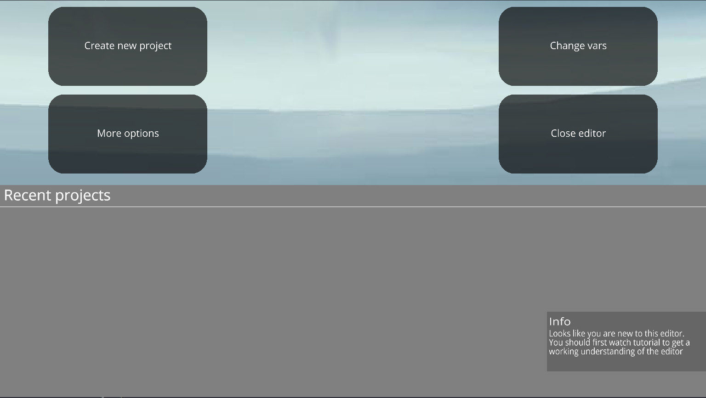
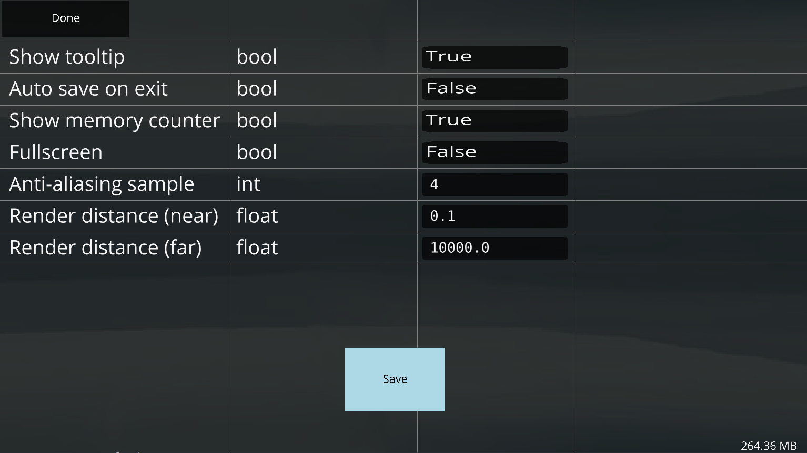
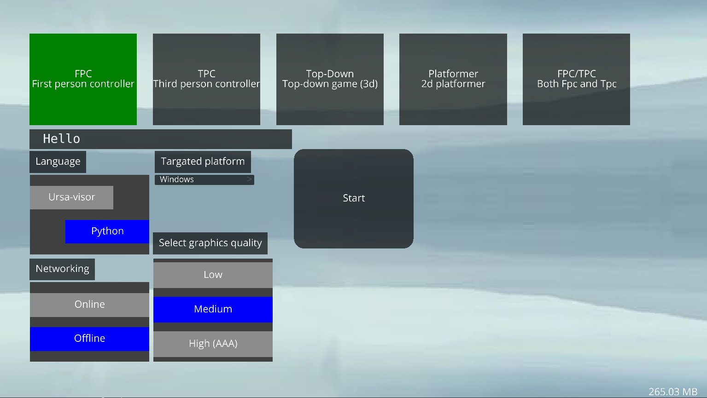
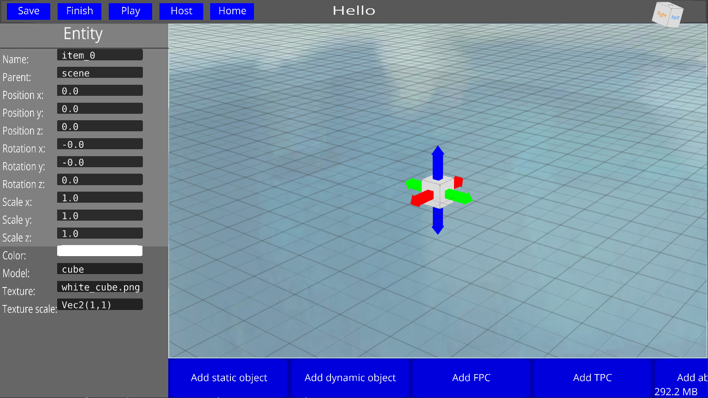
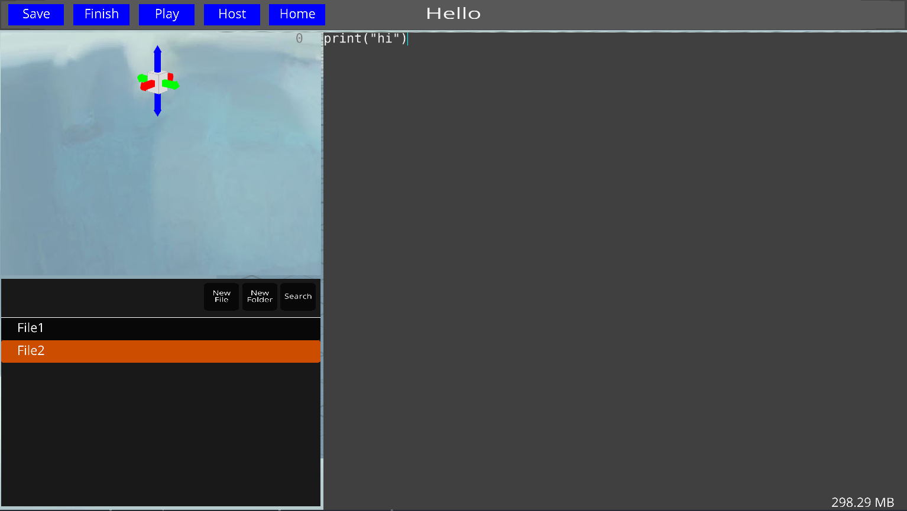
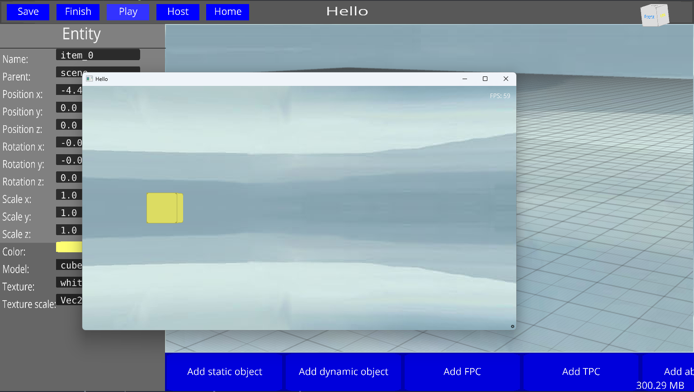
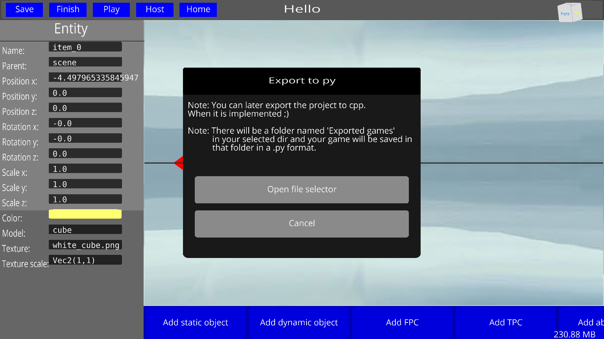

# GamePlus editor is a 3D gui editor for python.
This editor gives you the freedom to make 3D python games!

# Links
- Discord: [Discord server link](https://discord.gg/bhTDwU5rKH)

# How to install it?
It is very easy to install this editor, just open cmd and type `pip install GamePlusEditor`
now make a .py file and run it with the following code:
    ```from GamePlusEditor import RunEditor;
    RunEditor()```
it is as simple as this :)

# Features

-  With a simmple Ui


-  Configure the editor as you want!


-  Make new projects!


-  With a simple scene editor


-  A simple code editor


-  Play your project without leaving the editor


-  Export your project to py

This editor will currently write your games in python. But I'll add the feture to turn your .py into .exe ^_~
Backend supported by Ursina engine and panda3d 

# Contribute
Contributions to this project are welcome. If you have ideas for improving the editor, additional features, or bug fixes, please submit pull requests or open issues to discuss potential changes.
Note: If you want to directly contribute to the code of the project, you first need to have a working example of what you've added and why you want to be a contributor
